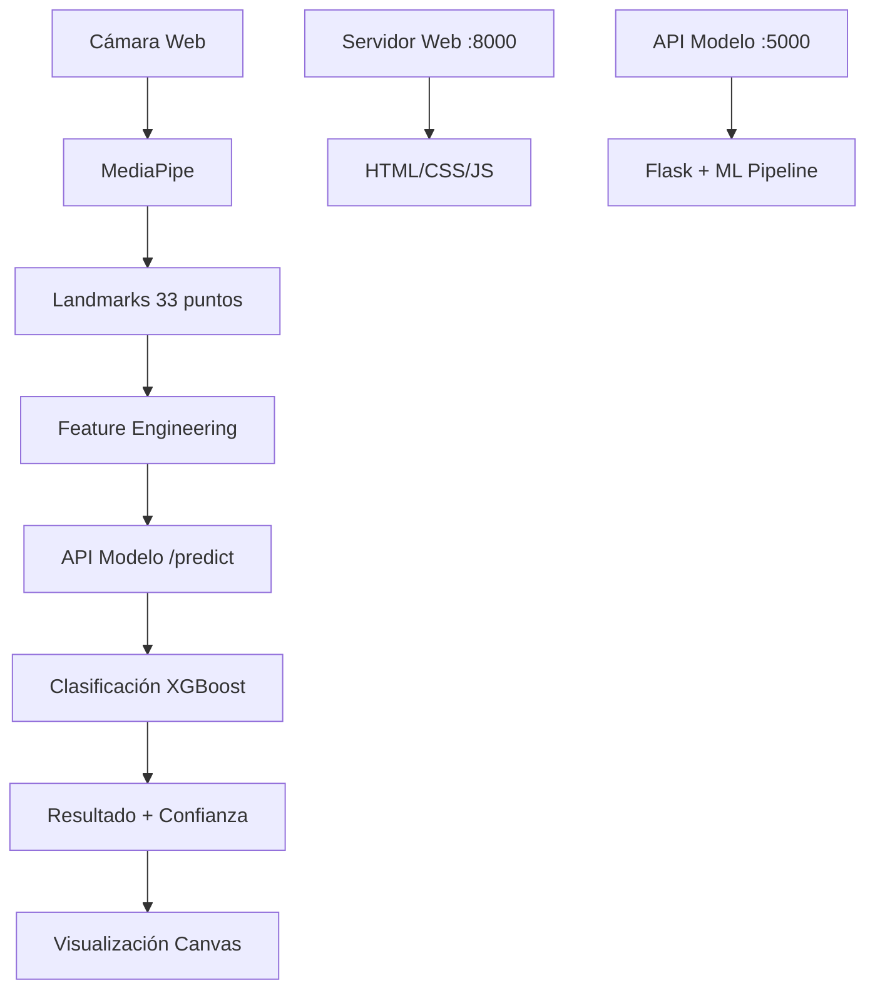

# Motion Classifier Model 🤖

## Autores ✒️

> - Juan David Colonia Aldana - A00395956
> - Miguel Angel Gonzalez Arango - A00395687
> - Pablo Fernando Pineda Patiño - A00395831

## Videos 💾

### [Data](https://icesiedu-my.sharepoint.com/:f:/g/personal/1105929455_u_icesi_edu_co/EnzCUqohRKJHkpldjByJuBMBwwkLNHv5qPzTzO7s-tlBMw?e=tvTkC7)

## 📋 Descripción

Esta aplicación web integra detección de poses en tiempo real con clasificación de movimientos corporales usando machine learning. Combina MediaPipe para la detección de landmarks con un modelo entrenado para clasificar 5 tipos de movimientos:

- **girar** - Movimientos de rotación
- **sentar** - Acción de sentarse
- **parar** - Posición de pie/parada
- **ir al frente** - Movimiento hacia adelante
- **devolverse** - Movimiento hacia atrás

## 🏗️ Arquitectura

```
┌─────────────────┐    ┌─────────────────┐    ┌─────────────────┐
│   Frontend      │    │   Servidor Web  │    │   API Modelo    │
│   (HTML/JS/CSS) │◄──►│   (server.py)   │◄──►│  (model_api.py) │
│                 │    │   Puerto 8000   │    │   Puerto 5000   │
└─────────────────┘    └─────────────────┘    └─────────────────┘
        │                                              │
        ▼                                              ▼
┌─────────────────┐                        ┌─────────────────┐
│   MediaPipe     │                        │   Modelo ML     │
│   (Poses)       │                        │   (XGBoost)     │
└─────────────────┘                        └─────────────────┘
```

## 🚀 Inicio Rápido

### Opción 1: Script Automático (Recomendado)

```bash
python start.py
```

### Opción 2: Manual

```bash
# 1. Instalar dependencias
pip install -r requirements.txt

# 2. Ejecutar servidor (inicia ambos: web + API)
python server.py
```

## 📁 Estructura de Archivos

```
motion-classifier-model/
├── 🌐 APLICACIÓN WEB
│   ├── server.py              # Servidor principal (puerto 8000)
│   ├── model_api.py           # API del modelo (puerto 5000)
│   ├── index.html             # Interfaz web
│   ├── script.js              # Lógica frontend + integración ML
│   ├── styles.css             # Estilos de la aplicación
│   └── start.py               # Script de inicio automático
│
├── 🤖 MODELO ENTRENADO
│   └── notebooks/models/      # Archivos del modelo exportado
│       ├── motion_classifier_*.joblib
│       ├── scaler_*.joblib
│       ├── label_encoder_*.joblib
│       ├── feature_engineer_*.joblib
│       └── model_metadata_*.json
│
├── 📊 NOTEBOOKS DE DESARROLLO
│   ├── notebooks/eda.ipynb           # Análisis exploratorio
│   └── notebooks/model_training.ipynb # Entrenamiento del modelo
│
├── 🔧 CONFIGURACIÓN
│   ├── requirements.txt        # Dependencias Python
│   └── README_WEB_INTEGRATION.md # Esta documentación
│
└── 📹 PROCESAMIENTO DE DATOS
    ├── video_processing_mediapipe.py
    ├── combine_data.py
    └── combined_dataset.csv
```

## 🎯 Funcionalidades

### ✅ Detección de Poses

- **MediaPipe Pose**: Detección de 33 landmarks corporales
- **Tiempo Real**: Procesamiento en vivo desde la cámara web
- **Visualización**: Landmarks y conexiones superpuestas

### 🤖 Clasificación de Movimientos

- **Modelo**: Entrenado con features geométricas avanzadas
- **Features Engineered**: Ángulos, distancias, proporciones corporales
- **Predicción en Tiempo Real**: Clasificación cada 500ms
- **Confianza Visual**: Barra de confianza con colores

### 🎨 Interfaz de Usuario

- **Diseño Moderno**: UI responsiva y atractiva
- **Estados Visuales**: Indicadores de estado del modelo y cámara
- **Controles Intuitivos**: Botones para iniciar/detener
- **Información en Tiempo Real**: FPS, estado del modelo, predicciones

## 🔧 Configuración Técnica

### Dependencias Principales

```
mediapipe          # Detección de poses
opencv-python      # Procesamiento de video
scikit-learn       # Machine learning
xgboost           # Modelo de clasificación
flask             # API del modelo
flask-cors        # CORS para API
pandas            # Manipulación de datos
numpy             # Operaciones numéricas
```

### Puertos Utilizados

- **8000**: Servidor web principal (HTML/CSS/JS)
- **5000**: API del modelo de clasificación

### Endpoints de la API

```
GET  /health       # Estado del servidor y modelo
POST /predict      # Clasificar movimiento desde landmarks
GET  /model-info   # Información detallada del modelo
```

## 📊 Pipeline de Procesamiento

```
1. 📹 Captura de Video (Cámara Web)
   ↓
2. 🔍 Detección de Poses (MediaPipe)
   ↓
3. 📐 Feature Engineering (Ángulos + Distancias)
   ↓
4. 🤖 Clasificación ML (XGBoost)
   ↓
5. 📊 Visualización (Canvas + Texto)
```

## 🎮 Uso de la Aplicación

1. **Iniciar**: Ejecuta `python start.py` o `python server.py`
2. **Navegador**: Ve a `http://localhost:8000`
3. **Permisos**: Permite acceso a la cámara
4. **Activar**: Haz clic en "Iniciar Cámara"
5. **Movimientos**: Realiza movimientos frente a la cámara
6. **Observar**: Ve las predicciones en tiempo real

## 🔍 Indicadores Visuales

### Estados del Modelo

- ✅ **Verde**: Modelo cargado y funcionando
- ❌ **Rojo**: Modelo no disponible
- ⚠️ **Amarillo**: Verificando estado

### Confianza de Predicción

- 🟢 **Verde** (>80%): Alta confianza
- 🟡 **Amarillo** (60-80%): Confianza media
- 🟠 **Naranja** (<60%): Baja confianza

### Estados de la Cámara

- 🔴 **Desconectado**: Cámara no iniciada
- 🟢 **Conectado**: Cámara activa y funcionando
- ⚠️ **Error**: Problema de acceso a cámara

## 🔄 Flujo de Datos



## 📈 Rendimiento

- **FPS**: ~15-30 FPS (dependiendo del hardware)
- **Latencia**: ~50-100ms por predicción
- **Precisión**: Variable según calidad del modelo entrenado
- **Recursos**: Moderado uso de CPU, mínimo GPU

## 🔮 Próximas Mejoras

- [ ] Historial de movimientos
- [ ] Exportación de datos de sesión
- [ ] Múltiples modelos seleccionables
- [ ] Calibración de sensibilidad
- [ ] Modo de entrenamiento en vivo
- [ ] Soporte para múltiples personas

---

## 🤝 Contribución

Para contribuir al proyecto:

1. Fork el repositorio
2. Crea una rama para tu feature
3. Realiza tus cambios
4. Envía un pull request

## 📄 Licencia

Este proyecto está bajo licencia MIT. Ver archivo LICENSE para más detalles.
